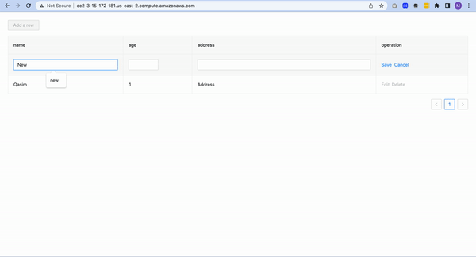
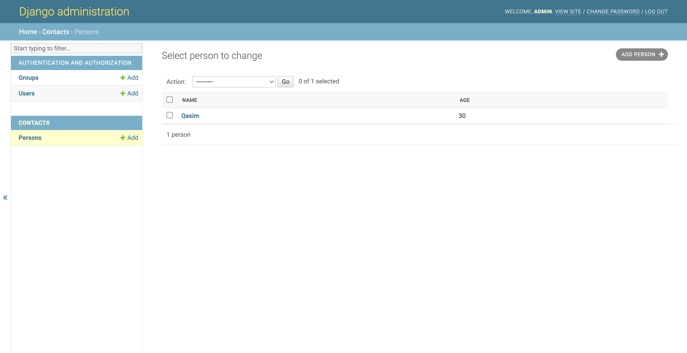
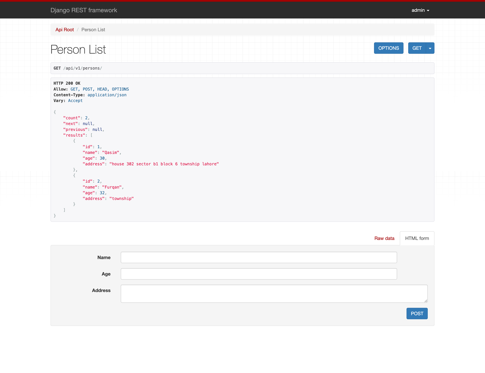

# Description

This project is a test assignment.

# Prerequisites

    1. Python 3.9.2
    2. Node v14.17.3
    3. Django
    
# How to setup
    1. `npm run build` or `npm run dev`
    2. `python3 manage.py migrate`
    3. `python3 manage.py runserver`
    
# Latest Screenshots
 Demo

 
 
 Home Page

 
 
 Admin View
 
  
 Persons API Endpoint
 
 
